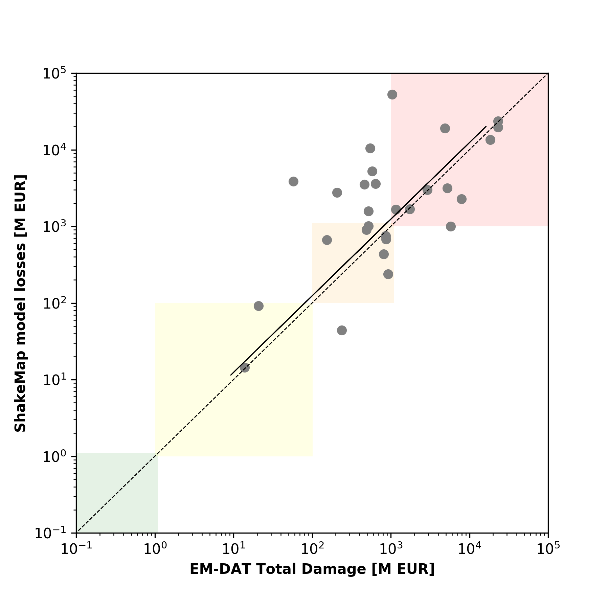
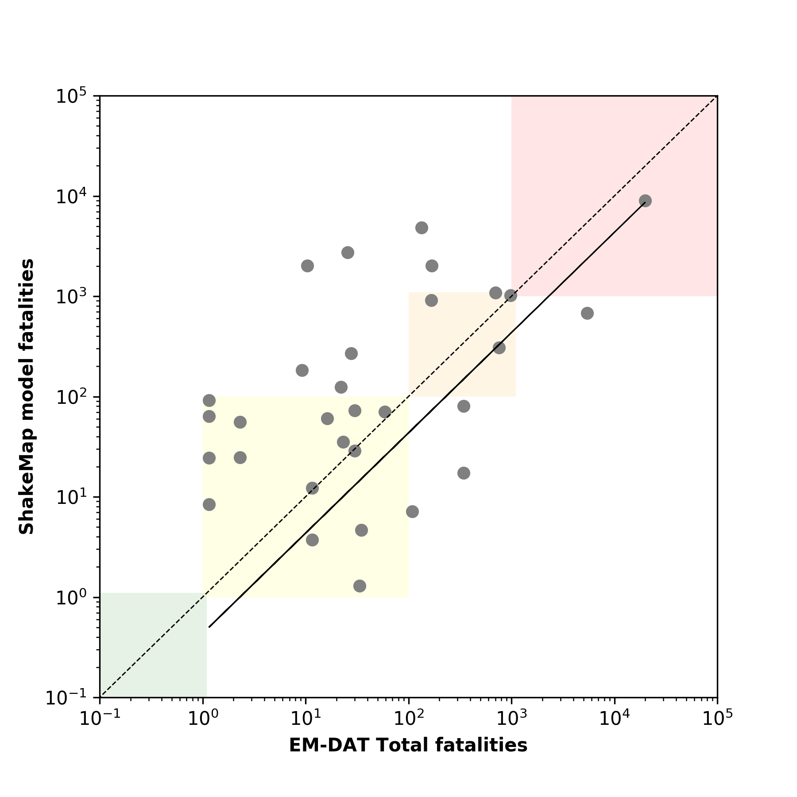

# Loss Data: Selected Damaging Events

The file `losses_selected_damaging_events.xlsx` includes both reported (from NCEI/WDS Global Significant Earthquake Database and EMDAT) and modelled losses (using ESRM20 exposure and vulnerability modelss : Crowley et al., 2021) for a number of damaging earthquake events that have occurred in Europe since 1980. The details of these events can be found in `models/selected_damaging_events` directory. 

Some plots comparing the reported and mean predicted losses are also provided. These plots also show the [USGS PAGER](https://earthquake.usgs.gov/data/pager/) alert levels (see Wald et al., 2022).   

## Comparison plots: NCEI/WDS Global Significant Earthquake Database

## Comparison plots: EMDAT

## References

Crowley H., Dabbeek J., Despotaki V., Rodrigues D., Martins L., Silva V., Romão, X., Pereira N., Weatherill G. and Danciu L. (2021) European Seismic Risk Model (ESRM20), EFEHR Technical Report 002, V1.0.0, [https://doi.org/10.7414/EUC-EFEHR-TR002-ESRM20](https://doi.org/10.7414/EUC-EFEHR-TR002-ESRM20)

EMDAT (n.d.) International Disasters Database of the Centre for Research on the Epidemiology of Disasters, Available at: [https://www.emdat.be/](https://www.emdat.be/) (accessed 15 September 2021).

National Geophysical Data Center / World Data Service (NGDC/WDS): NCEI/WDS Global Significant Earthquake Database. NOAA National Centers for Environmental Information. doi:10.7289/V5TD9V7K (accessed 21 November 2021)

Wald D.J., Maranoo K.D., Jaiswal K.S., Thompson E., James-Ravenell M.J. and Hearne M. (2022) "Evaluating a Decade of U.S. Geological Survey’s PAGER Real-Time Earthquake Loss Estimates" 12th National Conference on Earthquake Engineering, Salt Lake City, Utah. 

